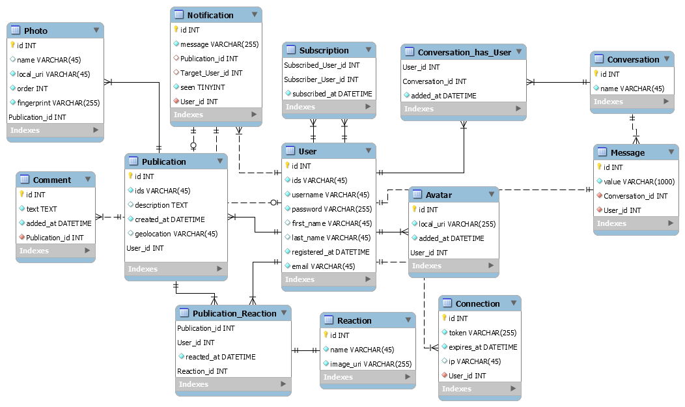

# sharepic
An instagram-like mobile app for an ETNA project (TIC-MOB2).

## API

Find the [documentation of the API here](./api).

## Install

```
docker-compose up -d
cd api
composer install
```

## Notes of the version

`-` : to do  
`~` : in progression  
`*` : done  
`/` : canceled  

## Database schema

The aim of the API is to provide a back-end infrastructure to a front-end webpage.
<p align="center">



</p>