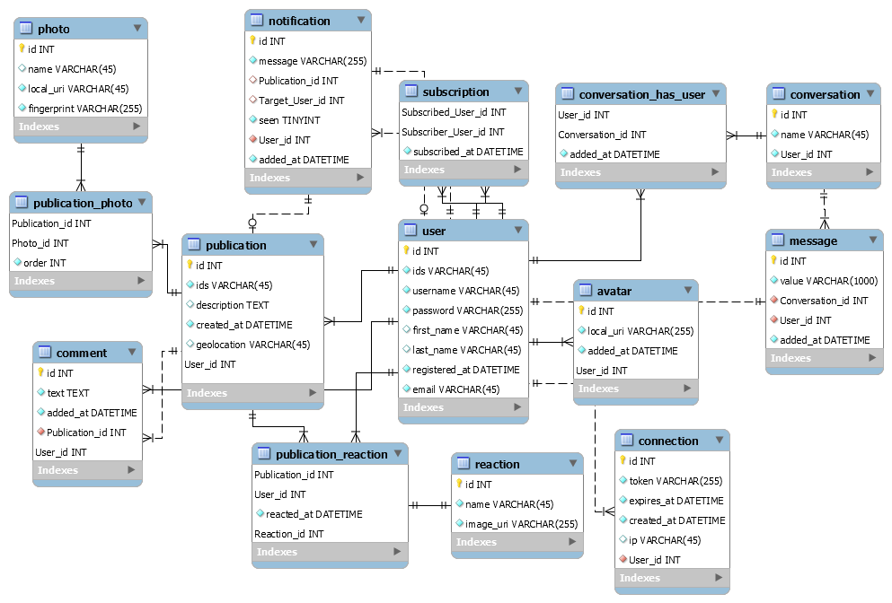

# sharepic
An instagram-like mobile app for an ETNA project (TIC-MOB2).

## API

:information_source: **Find the [documentation of the API here](./api).**

:information_source: You can get the PostMan API documentation here : [https://documenter.getpostman.com/view/782336/S17ruTKA](https://documenter.getpostman.com/view/782336/S17ruTKA).

## Install

**Requires Docker and Docker-Compose. Please install Docker.**.

Please run the following commands :

```
docker-compose up -d
cd api
composer install
php artisan migrate
php artisan db:seed
```

Then, access the API through `http://localhost`.

## Connection

You can connect with theses demo credentials :

- Username : `username`
- Password : `password`

OR

- Username : `flavienb`
- Password : `flav`

## Features

- Easy deploy with Docker
- Multiple photos per post
- Groups chats

## Database schema

The aim of the API is to provide a back-end infrastructure to a front-end webpage.
<p align="center">



</p>